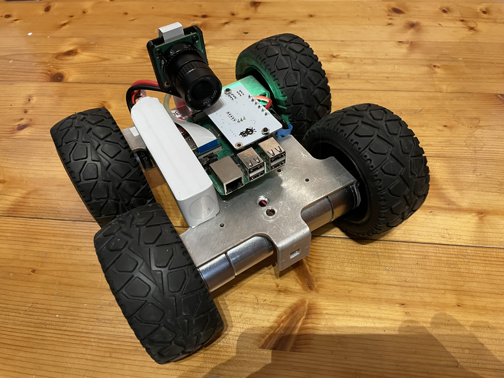
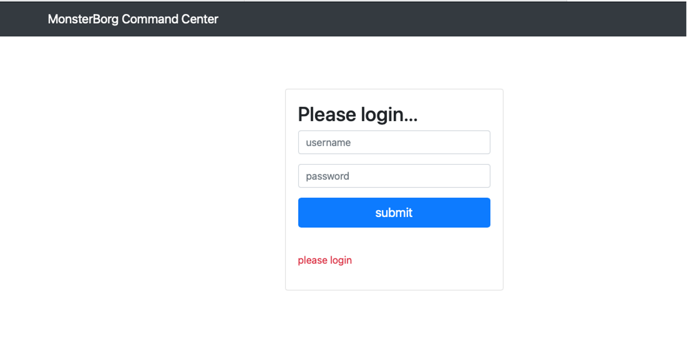
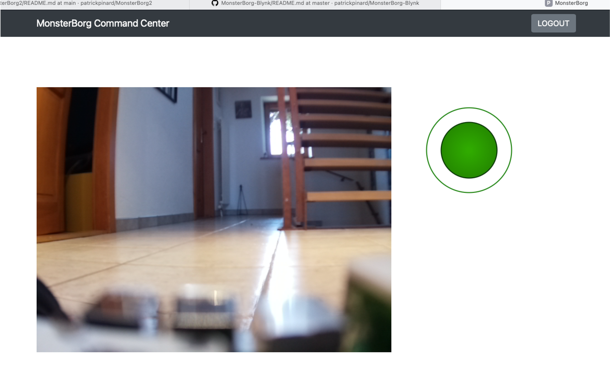

# MonsterBorg V2

....Documentation en cours de création.....

... reste à faire :  

   + activer la carte 4G en mode modem (sans nAT); 
   + améliorer l'interface web en incluant la lecture de paramètres (batterie, niveau du signal, etc.)
   + finaliser la documentation
   + log file complet

Voiture électrique de type Monsterborg contrôlée via interface Web en utilisant les technologies suivantes :

  - Python
  - Flask
  - CORS
  - Ajax
  - Restfull API
  - Threading
  - Bootstrap
  - HTML 5
  - javascript
  - POO (Programmation Orientée Objet)
  - streaming vidéo
  - Logging 
  - etc.

Ce projet consiste à piloter un véhicule électrique grâce à une simple application web embarquée sur un Raspberry PI. Le véhicule peut être piloté à distance grâce aux réseaux Wifi, 3/4G ou éventuellement 5G plus tard. 

Il est la suite du projet plus simple MonsterBorg V1 avec une APP Blynk qui est disponible ici : https://github.com/patrickpinard/MonsterBorg-Blynk

# Login page

Login page pour accéder au serveur Flask embarqué

# Command Center

Pilotage avec un joystick javascript et une caméra Pi embarquée (12Mx)

